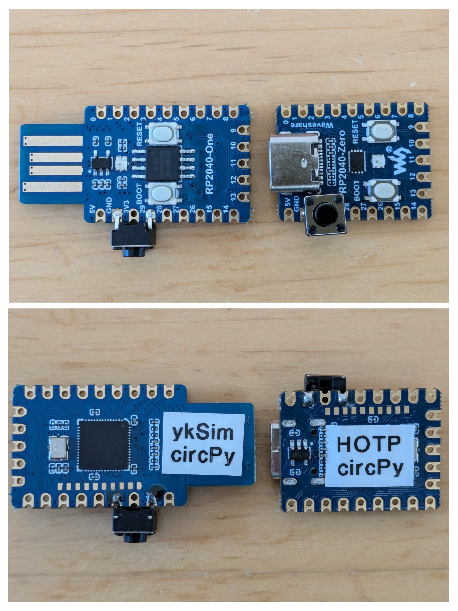

# cpy9-rp2040-yksim
YubiKey simulator for Raspberry Pi Picos and similar boards.

After having created the original [arduino-yksim](https://github.com/pagong/arduino-yksim) ten years ago,
I wanted to learn about CircuitPython and at the same time use the "RasPi Pico" in a useful project.


## Hardware
I've used the "RP2040-One" and "RP2040-Zero" boards (by 'WaveShare') during development of _YKSIM_.
Both modules are tiny in size and have an on-board NeoPixel LED.

Other RP2040 boards can also be used, but then `code.py` and `boot.py` need to be adapted to their GPIO pin layouts.

The _YKSIM_ implementation makes use of the USB-HID keyboard features of CircuitPython.
Each button press generates a new YubiKey OTP token, which gets send to your connected PC.


## Preparation
First you need to install "CircuitPython 9" to your RP2040 board. Go to the [download](https://circuitpython.org/downloads)
page and select the version that is suitable for your module. If you are unfamiliar with installing `UF2` firmware,
you should be starting at Adafruit's [learn](https://learn.adafruit.com/welcome-to-circuitpython/installing-circuitpython) page.

Second, you need to add a push button between GND and a digital IO pin of your RP2040 board.
- As you can see in the picture below, I've soldered one to Pin `GP29` and `GND` of the 'WaveShare' boards.
- On the original "RasPi Pico" Pin `GP15` and `GND` are conveniently located at the end of the module.
However, as the "Pico" does not have an on-board RGB LED, you need to add one externally as well.
- For the cheap "YD-RP2040" board no additional button is needed, as there is alreay a `USR` button at `GP24`.
This board comes with 16MB of flash and an on-board NeoPixel LED at `GP23`. (Which needs to be enabled with a solder jumper!)




This push button serves dual purposes:
- Pressing the button starts the computation of a YubiKey OTP token, which gets send to your PC via USB as a series of keyboard codes.
'Yubico' has selected the so-called 'modhex' encoding, to ensure that "YubiKeys" are compatible with most keyboard layouts.
- During normal operation of _YKSIM_ the `CIRCUITPY` drive is writable by the `code.py` script. On a connected PC it gets mounted read-only!
This is accomplished with special code in `boot.py`, which gets only executed once (at reboot of a RP2040).
To make the `CIRCUITPY` drive writable via USB, you MUST keep the push button _pressed_ during boot of the `Pico`!

See this [learn](https://learn.adafruit.com/circuitpython-essentials/circuitpython-storage) page for a detailed explanation.


## Design
The YubiKey simulator should be able to simulate several, different YubiKeys.
The configuration for the different YubiKeys is stored in the directory `/yk-ids` of the `CIRCUITPY` drive.

There is a file called `/default.json` to select which configuration gets used.

- When the _YKSIM_ device gets plugged into an USB port, it will turn on a `blue` LED to signal, that it is ready and waiting for user action.
- When the `USR` button is pressed, the LED will turn `green` until the YubiKey OTP token has been sent as KB codes via USB-HID.
- After that the LED will turn `red` for 3 seconds, to signal that the device is busy.
- Finally the LED will turn `blue` again. And the whole cycle can be repeated again.


## Details
### Directory layout of the `CIRCUITPY` drive

``` bash
$ ls -l
-rw-r--r-- 1 msd users  733 Aug 11 20:47 boot.py
-rw-r--r-- 1 msd users 2723 Aug 12 02:12 code.py
-rw-r--r-- 1 msd users   81 Aug 11 19:08 default.json
drwxr-xr-x 2 msd users 2048 Jan  1  2020 yk-ids
drwxr-xr-x 2 msd users 1024 Aug 10 10:12 yubiotp

$ tree
├── boot.py
├── code.py
├── default.json
├── lib
│   ├── adafruit_datetime.mpy
│   ├── adafruit_debouncer.mpy
│   ├── adafruit_hid
│   │   ├── consumer_control_code.mpy
│   │   ├── consumer_control.mpy
│   │   ├── __init__.mpy
│   │   ├── keyboard_layout_base.mpy
│   │   ├── keyboard_layout_us.mpy
│   │   ├── keyboard.mpy
│   │   ├── keycode.mpy
│   │   └── mouse.mpy
│   ├── adafruit_pixelbuf.mpy
│   ├── adafruit_ticks.mpy
│   ├── circuitpython_functools.mpy
│   └── neopixel.mpy
├── yk-ids
│   ├── config_luftundliebe.json
│   ├── config_vveinhundert.json
│   ├── config_vvuneduedrei.json
│   ├── session_luftundliebe.json
│   ├── session_vveinhundert.json
│   └── session_vvuneduedrei.json
└── yubiotp
    ├── crc.py
    ├── modhex.py
    └── otp.py
```

### Libraries
The code of _YKSIM_ is written in CircuitPython 9 and has several libraries as dependencies. Some of them are standard libraries 
of CircuitPython. Others need to be copied from the Adafruit (`adafruit-circuitpython-bundle-9.x-mpy-<date>.zip`) and 
Community (`circuitpython-community-bundle-9.x-mpy-<date>.zip`) bundles to the `/lib` folder of the `CIRCUITPY` drive.
Both library bundles can be downloaded from the CircuitPython [libraries](https://circuitpython.org/libraries) page.

``` bash
$ ls -l lib/
-rw-r--r-- 1 msd users 15686 Jul 30 05:15 adafruit_datetime.mpy
-rw-r--r-- 1 msd users  2025 Jul 30 05:15 adafruit_debouncer.mpy
drwxr-xr-x 1 msd users   270 Aug  9 23:52 adafruit_hid
-rw-r--r-- 1 msd users  2796 Jul 30 05:15 adafruit_pixelbuf.mpy
-rw-r--r-- 1 msd users   634 Jul 30 05:15 adafruit_ticks.mpy
-rw-r--r-- 1 msd users   718 Aug  6 05:15 circuitpython_functools.mpy
-rw-r--r-- 1 msd users  1318 Jul 30 05:15 neopixel.mpy
```

| script name | needs these libraries | and these dependencies |
| --- | --- | --- |
| boot.py | board<br>digitalio<br>storage | -- |
| code.py | json<br>time<br>board<br>digitalio | -- |
| code.py | usb_hid<br>neopixel<br>adafruit_debouncer | adafruit_hid<br>adafruit_pixelbuf<br>adafruit_ticks |
| --- | --- | --- |
| yubiotp/otp.py | binascii<br>struct<br>random<br>aesio<br>adafruit_datetime | -- |
| yubiotp/modhex.py | binascii<br>struct<br>circuitpython_functools | -- |
| yubiotp/crc.py | -- | -- |

### YubiKey algorithm
For the YubiKey algorithm an implementation written in CPython by [django-otp](https://github.com/django-otp/yubiotp)
has been re-used and adapted for CircuitPython. These routines are located in the `/yubiotp` directory.
Some libraries and functions of CircuitPython have different names and parameters (e.g. `aesio`).  
(And CircuitPython does NOT like blanks in the format strings of `struct.pack` and `struct.unpack` either !!)

``` bash
$ ls -l yubiotp/
-rw-r--r-- 1 msd users   919 Nov 17  2023 crc.py
-rw-r--r-- 1 msd users  2832 Aug  9 23:16 modhex.py
-rw-r--r-- 1 msd users  7156 Aug 10 06:54 otp.py
```

### Configuration
The YubiKey simulator is able to simulate several, different YubiKeys.
The configurations for the different keys are stored in the directory `/yk-ids` of the `CIRCUITPY` drive.
``` bash
$ ls -l yk-ids/
-rw-r--r-- 1 msd users 133 Aug 11 21:28 config_luftundliebe.json
-rw-r--r-- 1 msd users  15 Aug 11 21:03 session_luftundliebe.json

-rw-r--r-- 1 msd users 133 Aug 11 21:22 config_vveinhundert.json
-rw-r--r-- 1 msd users  14 Aug 11 21:38 session_vveinhundert.json

-rw-r--r-- 1 msd users 133 Aug 11 21:29 config_vvuneduedrei.json
-rw-r--r-- 1 msd users  17 Jan  1  2020 session_vvuneduedrei.json
```

There is a file in the root directory called `/default.json` to select which configuration (i.e. `publicid`) gets used.
```
{
  "directory": "/yk-ids/",
  "config": "config_",
  "public": "luftundliebe"
}
```

For each simulated YubiKey there are two files in the `/yk-ids` directory: `config_<publicid>.json` and `session_<publicid>.json`.
The `<publicid>` matches the "Public Id" of the YubiKey algorithm.
```
{
  "public": "luftundliebe",
  "private": "geilerkeiler",
  "aeskey": "gutenbergdrucktebuecherundbibeln",
  "session": "session_"
}
```

`default.json` and `config_<publicid>.json` are read-only files and are never changed after initial configuration of _YKSIM_.
Whereas the file `session_<publicid>.json` gets rewritten each time, when the session counter of the _YKSIM_ is incremented.
(That's why we need the `boot.py` trick, that's already been mentioned.)
```
{"counter": 42}
```

## Caveat!
As the `aeskey` in the config file is not protected by cryptography, the _YKSIM_ is not a very secure device!

